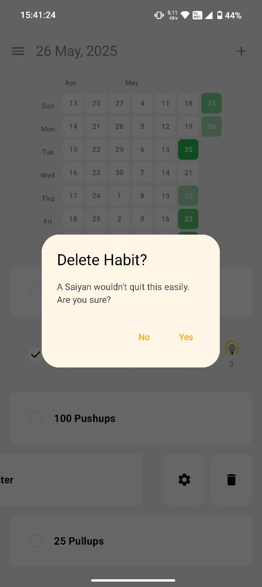

# Kaizen ~ The Saiyan Way

**Kaizen ~ The Saiyan Way** is the mindset of constant growth and rising beyond limits. Like a Saiyan, it’s about embracing challenges, learning from failure, and improving every day — no matter how strong you already are!

---

## Features

- ✅ Add, update, and delete daily habits
- 📅 Automatic daily habit tracking
- 🔄 Real-time data synchronization with Firebase Firestore
- 🔥 Streak tracking
- 🌗 Supports both **Dark Mode** and **Light Mode** for comfortable use
- 📊 Analytics overview of your progress over the past year

---

## Screenshots

| Screen           | Light Mode                                    | Dark Mode                                    |
|-------------------|-----------------------------------------------|-----------------------------------------------|
| SignIn Screen     |    |    |
| Home Screen     |    |    |
| Loading Screen     |    |    |
| Create Habit     |    |    |
| Delete Habit     |    |    |
| Navigation Bar    |    |    |
| Analytics Screen     |    |    |
| Settings Screen     |    |    |

---
## Setup Instructions

1. **Clone the repository:**
   ```bash
   git clone https://github.com/lamak-shahiwala/Kaizen.git

2. **Open the project in Android Studio:**
    - Launch Android Studio.
    - Click **File > Open** and navigate to the cloned Kaizen folder.
    - Select the project and open it.
    - Allow Gradle to sync and download dependencies.

3. **Configure Firebase:**
    - Go to [Firebase Console](https://console.firebase.google.com/).
    - Create a new project or use an existing one.
    - Register your Android app with the package name in `app/build.gradle`.
    - Download the `google-services.json` file.
    - Place the file inside the `app/` directory of your project.

4. **Build and run the app:**
    - Connect an Android device or start an emulator.
    - Click the **Run** button in Android Studio.
    - Select your device/emulator if prompted.
    - Wait for the app to build and install.
---
If you have questions or encounter issues, please open an issue in the repository. Happy Coding!
